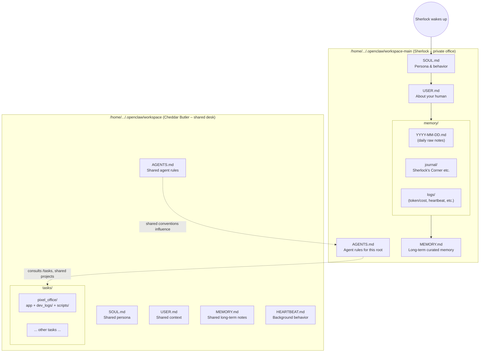

What current OpenClaw agent sees when he wakes up:

```mermaid
flowchart TD

    subgraph WSmain["/home/.../.openclaw/workspace-main (Sherlock – private office)"]
      A1[SOUL.md\nPersona & behavior]
      A2[USER.md\nAbout your human]
      A3[AGENTS.md\nAgent rules for this root]
      A4[MEMORY.md\nLong-term curated memory]

      subgraph M1["memory/"]
        M2["YYYY-MM-DD.md\n(daily raw notes)"]
        M3["journal/\nSherlock's Corner etc."]
        M4["logs/\n(token/cost, heartbeat, etc.)"]
      end
    end

    subgraph WS["/home/.../.openclaw/workspace (Cheddar Butler – shared desk)"]
      B1[SOUL.md\nShared persona]
      B2[USER.md\nShared context]
      B3[AGENTS.md\nShared agent rules]
      B4[MEMORY.md\nShared long-term notes]
      B5[HEARTBEAT.md\nBackground behavior]

      subgraph T["tasks/"]
        T1["pixel_office/\napp + dev_logs/ + scripts/"]
        T2["... other tasks ..."]
      end
    end

    %% Boot sequence for main chat (Sherlock)
    Start((Sherlock wakes up)) --> A1 --> A2 --> M1 --> A4

    %% Cross-link: Sherlock can reference shared workspace
    A3 -. consults /tasks, shared projects .-> T
    B3 -. shared conventions influence .-> A3
```
