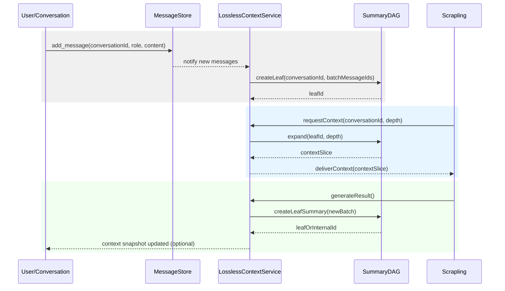
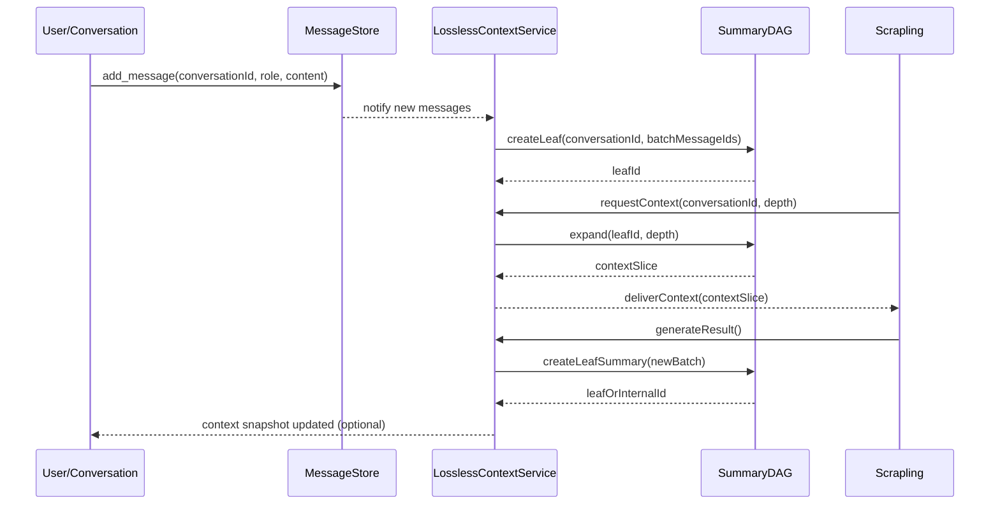

Color map:

```mermaid
sequenceDiagram
    participant User as User/Conversation
    participant DB as MessageStore
    participant LCS as LosslessContextService
    participant DAG as SummaryDAG
    participant Scrap as Scrapling

    rect rgb(240,240,240)
        User->>DB: add_message(conversationId, role, content)
        DB-->>LCS: notify new messages
        LCS->>DAG: createLeaf(conversationId, batchMessageIds)
        DAG-->>LCS: leafId
    end

    rect rgb(230,245,255)
        Scrap->>LCS: requestContext(conversationId, depth)
        LCS->>DAG: expand(leafId, depth)
        DAG-->>LCS: contextSlice
        LCS-->>Scrap: deliverContext(contextSlice)
    end

    rect rgb(240,255,240)
        Scrap->>LCS: generateResult()
        LCS->>DAG: createLeafSummary(newBatch)
        DAG-->>LCS: leafOrInternalId
        LCS-->>User: context snapshot updated (optional)
    end
```

Black and white:

```mermaid
sequenceDiagram
participant User as User/Conversation
participant DB as MessageStore
participant LCS as LosslessContextService
participant DAG as SummaryDAG
participant Scrap as Scrapling

User->>DB: add_message(conversationId, role, content)
DB-->>LCS: notify new messages
LCS->>DAG: createLeaf(conversationId, batchMessageIds)
DAG-->>LCS: leafId
Scrap->>LCS: requestContext(conversationId, depth)
LCS->>DAG: expand(leafId, depth)
DAG-->>LCS: contextSlice
LCS-->>Scrap: deliverContext(contextSlice)
Scrap->>LCS: generateResult()
LCS->>DAG: createLeafSummary(newBatch)
DAG-->>LCS: leafOrInternalId
LCS-->>User: context snapshot updated (optional)

```
