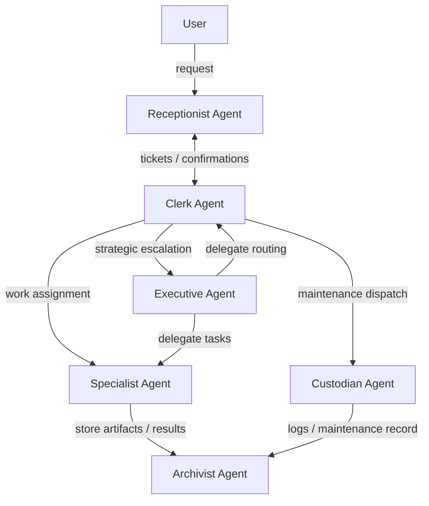

```mermaid
flowchart TD

    U[User]
    R[Receptionist Agent]
    C[Clerk Agent]
    E[Executive Agent]
    S[Specialist Agent]
    K[Custodian Agent]
    A[Archivist Agent]

    U -->|request| R

    R <--> |tickets / confirmations| C

    C -->|strategic escalation| E
    C -->|work assignment| S
    C -->|maintenance dispatch| K

    E -->|delegate tasks| S
    E -->|delegate routing| C

    S -->|store artifacts / results| A
    K -->|logs / maintenance record| A
```
