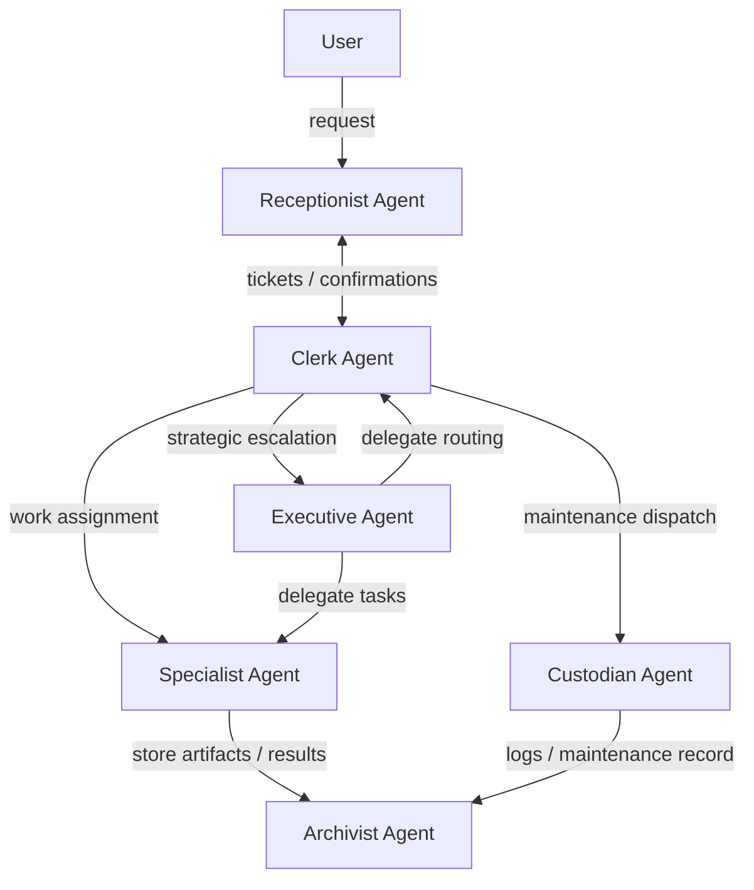
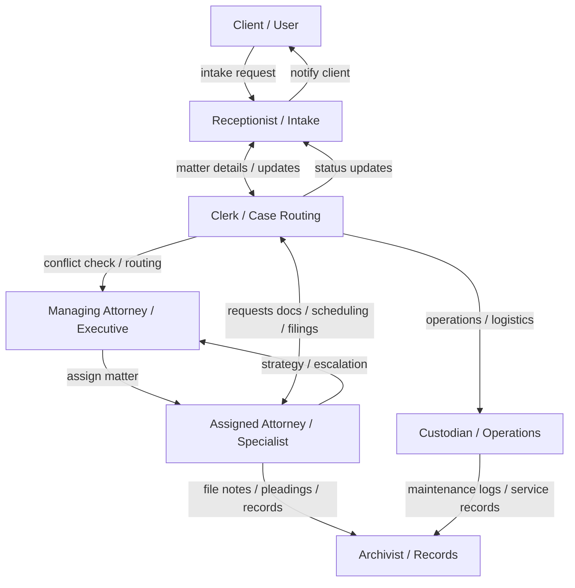

#General Agent Work Flow

```mermaid
flowchart TD

    U[User]
    R[Receptionist Agent]
    C[Clerk Agent]
    E[Executive Agent]
    S[Specialist Agent]
    K[Custodian Agent]
    A[Archivist Agent]

    U -->|request| R

    R <--> |tickets / confirmations| C

    C -->|strategic escalation| E
    C -->|work assignment| S
    C -->|maintenance dispatch| K

    E -->|delegate tasks| S
    E -->|delegate routing| C

    S -->|store artifacts / results| A
    K -->|logs / maintenance record| A
```

# Legal

```mermaid
flowchart TD

    U[Client / User]
    R[Receptionist / Intake]
    C[Clerk / Case Routing]
    E[Managing Attorney / Executive]
    S[Assigned Attorney / Specialist]
    K[Custodian / Operations]
    A[Archivist / Records]

    U -->|intake request| R
    R <--> |matter details / updates| C

    C -->|conflict check / routing| E
    E -->|assign matter| S

    S <--> |requests docs / scheduling / filings| C
    S -->|strategy / escalation| E
    S -->|file notes / pleadings / records| A

    C -->|operations / logistics| K
    K -->|maintenance logs / service records| A

    C -->|status updates| R
    R -->|notify client| U
```
