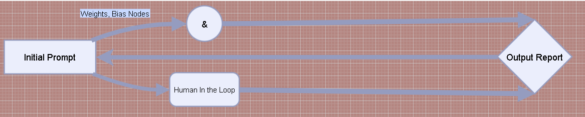

# The Lavender Fields Project 🌞   
A collection of scripts, models, and simple functions to aid in data analysis and advanced natural system processing frameworks.  

The /scripts and /examples directores are serving similar purposes in this repository. The old adage of not fixing what isn't broken is honored to avoid breaking any links in previous updates.  🩹

The general intended process flow for most of the scripts in this project is as follows:  

  

Project Updates

### Update 3.2.25

The [Recursive Agent Script](https://github.com/Photon1c/LavenderFieldsProject/blob/main/scripts/recursive_llm_with_hil.py) is now available. It demonstrates performance issues with functions that call themselves.  

### Update 3.1.25  

Orchestrating subagent frameworks can be done easily with Claude now, [this script](../scripts/Claude_subagent_framework.py) is an example of this implementation.  

### Update 2.22.25 -

Advanced LLM Agent Conversations [released](../scripts/LLM-AgentConversations-TinyTroupe.py)  

### Update 2.18.25 -   

AI Pilot Script [now available](../scripts/AI_pilot.py). Using recursive learning, this experimental script trains a model to pilot a vehicle and a avoid obstacles using recursive learning. 

New cover photo:  
  

Old cover photo:  
  
